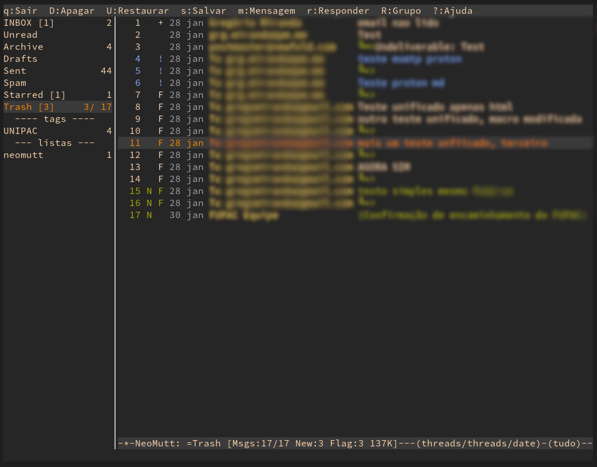

# My dotfiles

Central repository for my config files.
Feel free to browse, copy, or modify them in any way.

# Installation and Usage

Getting and using it with git and [stow](https://www.gnu.org/software/stow/) is pretty and beautifully straightforward:

``` Bash
git clone git@github.com:ggio/dotfiles.git ~/.dotfiles
cd ~/.dotfiles
stow --dotfiles .
```

# Ansible - Dotfiles and packages management

This repository contains a collection of Ansible playbooks for setting up and managing my Fedora workstations. 
Each playbook utilizes various roles to perform specific tasks:

Included playbooks:
- **fedora_unified.yml**: all-in-one setup, ideal for fresh installs.
- **dotfiles**: automates the management of config files using `stow`, adapted
  from [@phelipetls](https://github.com/phelipetls)'s guide on [Ansible for dotfiles](https://phelipetls.github.io/posts/introduction-to-ansible/#stow).
- **neomutt.yml**: handles email-related packages and configurations.
- **packages.yml**: installs my go-to packages via `dnf` and `flatpak`.


# Neovim - Text editor

My Neovim configuration, based on [kickstart.nvim](https://github.com/nvim-lua/kickstart.nvim) (as a starting point) and [benbrastmckie/.config](https://github.com/benbrastmckie/.config) (for LaTeX related plugins and settings).

Some added features, plugins and tweaks:

* Made kickstart.nvim **modular**, for readability and maintenance.
* [markdown-preview](https://github.com/iamcco/markdown-preview.nvim) and [md-to-html](https://github.com/realprogrammersusevim/md-to-html.nvim) for working with md files.
* [oil.nvim](https://github.com/stevearc/oil.nvim), a amazing file/directory explorer.
* [rainbow_csv](https://github.com/cameron-wags/rainbow_csv.nvim) for working with csv files.
* [VimTex](https://github.com/lervag/vimtex) for LaTeX filetype and syntax.
* [papis.nvim](https://github.com/jghauser/papis.nvim), a nice interface for `papis`, a CLI and TUI bibliography manager.

# NeoMutt and company - CLI email system

Here are my main config files for `NeoMutt` and its ecosystem.

I also adapted a nice Gruvbox color theme from
[shuber2](https://github.com/shuber2/mutt-gruvbox).



I’ve left out files containing sensitive information, such as:

* `isync` and `msmtp` dotfiles
* `abook` database
* `NeoMutt` aliases and personal info

But these are quite situational, anyway. You can learn more about them in the docs.

# Zathura - Document viewer (for PDF, mostly)

Based on [benbrastmckie/.config](https://github.com/benbrastmckie/.config)
`zaturarc`, but modularized to separate the color themes for general settings.

To change the theme, modify this line:

``` zaturarc
include themes/gruvbox-light
```

# papis - CLI bibliography manager

Based on [avonmoll's gist guide](https://gist.github.com/avonmoll/e435f0e478fbdc6c1eee7557b221a7e2).

# Extra setup

* **Bash Aliases**: custom aliases are stored in `.bashrc.d`.
* **Font**: [FiraCode Nerd Font](https://www.nerdfonts.com/font-downloads) (used for Neovim).
* **Icons**: [Gruvbox-Plus-Dark Icon Pack](https://github.com/SylEleuth/gruvbox-plus-icon-pack).
